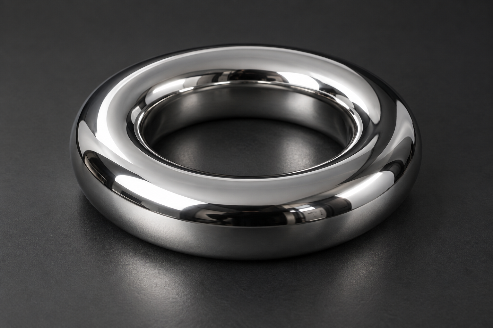

# Brightpixels

Dependency-free JavaScript for HDR text, image highlights, shapes, edge glow, interaction feedback, and particles. Brightpixels uses extended-range WebGPU rendering, with ordinary-color fallbacks when HDR rendering is unavailable.

**Version 1.4.0** — [npm package](https://www.npmjs.com/package/brightpixels) · [Release notes](./CHANGELOG.md)

[Main demo](https://echohtp.github.io/brightpixels/) · [HDR particle lab](https://echohtp.github.io/brightpixels/particles.html) · [Dreamnet](https://echohtp.github.io/brightpixels/dreamnet.html) · [Hardware test](https://echohtp.github.io/brightpixels/hardware.html)

## What's new in 1.4.0

- `trackAction` follows real promises: loading light, success or error, with stale-response protection.
- `burstFrom` launches HDR confetti or sparks from an element's current center or edge.
- `bindHold`, `bindSwipe` and `bindDrag` connect touch and keyboard gestures to surface charge.
- `createEffectSequence` coordinates finite charge, sweep, group and particle effects, with replay and cancellation.
- A compact [Action Lab](https://echohtp.github.io/brightpixels/actions.html), thicker finger trails, and lifecycle checks across Chromium and WebKit.

## Interactive effects from 1.3

- Interactive HDR surfaces: spotlights, press ripples, full-container feedback and travelling edge lights.
- Drawable neon trails, directional sweeps and two-color gradients.
- Charge feedback for progress, holds and toggles, driven by your own application state.
- `createSurfaceGroup` coordinates bursts across up to 32 surfaces with direction and staggering.
- Optional React 18/19 component, canvas fallbacks, reduced-motion alternatives and automatic surface cleanup.

[Try interactive surfaces](https://echohtp.github.io/brightpixels/surfaces.html) · [Surface API](#interactive-surfaces)

## Included from 1.2.0

- A falling HDR confetti shower with recycling, pause/resume, wind, source regions, and tumbling paper.
- Optional `<BrightConfetti />` for React 18/19, with live props, a restart ref, completion callbacks, and cleanup on unmount.
- The same controller without React through `brightpixels/confetti`.
- Automatic viewport sizing, bounded fallback rendering, and one stationary sparkle batch for reduced motion.

[Try React confetti](https://echohtp.github.io/brightpixels/confetti.html) · [API and migration notes](#confetti-and-react)

## Included from 1.1.0

- Optional `brightpixels/particles` module for HDR confetti, sparks and mouse trails.
- One reusable viewport canvas per engine, with GPU-computed motion and instanced drawing.
- Canvas fallback, reduced-motion sparkles, explicit cleanup and global brightness controls.
- TypeGPU generates shader structures and buffer offsets at build time. No runtime dependencies.

[Try the particle lab](https://echohtp.github.io/brightpixels/particles.html) or [jump to the particle API](#hdr-particles).

## Core features

- Stable public API for HDR text, images, shapes, progress and status indicators.
- Existing-element edge glow and touch, mouse and keyboard interaction feedback.
- Viewport-aware rendering and auto/high/low quality controls.
- Capability snapshots, fallback reasons and copyable hardware diagnostics.
- Chromium/WebKit browser checks and React / TypeScript integration checks.

[Try the hardware demo](https://echohtp.github.io/brightpixels/hardware.html).

## Installation

```bash
npm install brightpixels
```

For an exact version, use `npm install brightpixels@1.4.0`.

Import the package once to register `<bright-text>`, `<bright-image>`, and `<bright-shape>`:

```js
import "brightpixels";
```

Import the optional particle engine when you need confetti, sparks, or mouse trails:

```js
import { createParticleEffects } from "brightpixels/particles";
```

The main import does not load particle code. The core, particles, and vanilla confetti
entry points include TypeScript declarations and have zero runtime dependencies.
The optional React confetti and surface components use your application's React 18 or 19 installation.

For a page without a bundler, copy `index.js` from this repository and load it as a module:

```html
<script type="module" src="./index.js"></script>
```

## Interaction helpers

[Try the chain reaction](https://echohtp.github.io/brightpixels/actions.html).

```js
import { brightenSurface } from 'brightpixels';
import { trackAction, bindHold } from 'brightpixels/interactions';
import { createParticleEffects } from 'brightpixels/particles';

const light = brightenSurface(card, { intensity: 10 });
const particles = createParticleEffects();
const feedbackAbort = new AbortController();
const hold = bindHold(button, {
  surface: light,
  duration: 700,
  onComplete: () => {
    // Your application starts the action and handles its result.
    trackAction(light, save(), { signal: feedbackAbort.signal })
      .then(() => {
        if (!feedbackAbort.signal.aborted) particles.burstFrom(button, { count: 120 });
      })
      .catch(showError);
  },
});
// On unmount:
feedbackAbort.abort(); hold.destroy(); particles.destroy(); light.destroy();
```

The optional `brightpixels/interactions` entry has TypeScript declarations, no
runtime dependencies and no import-time DOM work. It does not load the particle
renderer; import `brightpixels/particles` when a sequence needs particles.

### Action feedback

`trackAction(surface, promise, { signal, success, error })` returns a promise with
the original value or rejection. The newest tracked request owns that surface's
loading and outcome light; older responses never overwrite it. Outcomes default
to `success` / `error`; either can be a surface flash kind or `false`. An
`AbortError` produces no error flash.

Aborting the signal, scrolling, resizing, hiding/removing the target or leaving
the page stops the feedback. **It does not abort your request or change its
result.** Pass your own AbortSignal to `fetch` to cancel application work. Your
app owns `aria-busy`, status text and concurrency decisions.

### Touch and keyboard bindings

| Helper | Element and interaction |
| --- | --- |
| `bindHold(button, options)` | Native button. Hold pointer, Space or Enter; release at full charge to complete. Assistive-technology click activates directly. |
| `bindSwipe(range, options)` | Native `input[type="range"]`. Reach its maximum and release. Keyboard arrows or End adjust; Enter confirms. Partial gestures reset to minimum. |
| `bindDrag(region, options)` | Existing region. Drag horizontally (or `{ axis: 'y' }`); arrows adjust by 10%, Home/End select bounds, Enter commits. |

All three accept `{ surface, signal, onProgress, onComplete, onCancel }` and
return `{ active, progress, cancel(), destroy() }`. `surface` is optional;
`onProgress` receives 0–1, then zero on release/cancel. `onComplete` receives the
final progress, once, after reset. Charge is temporary; selection is unchanged.
Use `onComplete` for the gesture's application action, rather than a separate
click handler. The binding never invokes existing click handlers itself.

Holds default to 700ms (150–5000ms), with an 18px movement tolerance (4–100px).
Scroll, resize, blur, pointer cancellation, Escape, disabled/hidden/detached
targets and abort cancel active gestures. Destroy removes bindings. Vertical
page scrolling stays available during a horizontal drag; the helper restores
the previous inline `touch-action` when destroyed.

For a drag region, provide your own focusability and semantics. For example,
use `role="slider"`, `tabindex="0"`, a label and `aria-valuemin/max/now`; update
`aria-valuenow` in `onProgress`. Prefer the native range swipe when it fits.
Reduced motion preserves gesture timing and application callbacks; surfaces
show static charge and outcome light instead of travelling effects.

### Element particle origins

```js
particles.burstFrom(button, { count: 120, flutter: true });
particles.burstFrom(card, { edge: 'right', shape: 'spark', count: 60 });
```

`edge` is `center` (default), `top`, `right`, `bottom` or `left`. Bursts start at
the center or edge midpoint and point outward unless `angle` is supplied.
Options otherwise match `burst`, except `x`/`y`: the engine measures current
viewport bounds on each call, including CSS transforms, scroll and resize.
Hidden, detached, zero-sized and offscreen elements emit nothing. Paused or
destroyed engines also emit nothing. Existing particle caps, fallbacks and
stationary reduced-motion sparkles still apply.

### Effect sequences

```js
import { createEffectSequence } from 'brightpixels/interactions';
import { createSurfaceGroup } from 'brightpixels';

const group = createSurfaceGroup(neighboringSurfaceControllers);
const sequence = createEffectSequence([
  { effect: 'charge', surface: light, value: 1, duration: 350 },
  { effect: 'sweep', surface: light, duration: 400 },
  { effect: 'group', group, options: { from: 'start', stagger: 80 }, duration: 250 },
  { effect: 'particles', engine: particles, target: button, options: { count: 120 } },
  { effect: 'charge', surface: light, value: 0, duration: 200 },
]);
const result = await sequence.play({ signal: feedbackAbort.signal });
// result is 'completed' or 'cancelled'. Replay cancels the previous run.
sequence.cancel();
// On unmount: sequence.destroy(); group.destroy(); clean up your controllers.
```

Steps support `charge`, `sweep`, `flash`, `ripple`, `group`, `particles` and
`wait`. Sequences accept 1–64 steps, at most 5 seconds per step and 30 seconds
total. `duration` is the charge animation length or the delay before the next
step; it also sets sweep length (the renderer limits sweeps to 150–1500ms).
Defaults: charge 400ms, sweep 500ms, wait 100ms, other steps zero. Add a duration
if the next effect should wait for a flash, ripple or group wave to finish.

`play()` resolves once steps and delays have dispatched. Emitted particles and
already-started group effects finish on their own. Cancellation removes queued
steps/group responses, cancels transient effects on touched individual surfaces
and restores their pre-run charge. It never destroys borrowed controllers or
clears another burst from a shared particle engine. Reserve those surfaces'
transient feedback for the sequence while it runs; do not concurrently track an
action on the same surface. Unexpected renderer errors reject `play()`.

Scroll, resize, blur, hidden/detached targets, an aborted signal or a change to
reduced motion cancels a run. In reduced motion, charge changes immediately,
sweeps become static flashes, group staggering stops, particles stay stationary,
and animated delays disappear. Explicit `wait` steps retain their duration.

## Interactive surfaces

[Try the surface demo](https://echohtp.github.io/brightpixels/surfaces.html).

```js
import { brightenSurface } from 'brightpixels';

const card = document.querySelector('.card');
const glow = brightenSurface(card, { color: '#55eeff', intensity: 10 });

// Descendant controls automatically light the containing surface on press.
// Your app still owns the work and its outcomes.
glow.setLoading(true);
// When the work finishes:
glow.setLoading(false).flash('success');

const unlink = glow.link(document.querySelector('#another-button'), { kind: 'notify' });
// During your cleanup:
unlink();
glow.destroy();
```

A surface adds one inert overlay to a **connected HTML container**, such as a
`div`, `section`, `article` or `button`. Replaced elements, form inputs and table
structural elements are unsupported and throw. Imports are SSR-safe; call the
helper after mounting. Repeated calls for the same element merge options and
return the existing controller.

| Option | Default | Behavior |
| --- | --- | --- |
| `color`, `colorEnd`, `intensity` | `'#55eeff'`, `''`, `8` | Base CSS color, optional second RGB color and HDR strength clamped to 1–16. Surface colors convert to sRGB. |
| `spotlight`, `spotlightSize` | `true`, `180` | Mouse/pen tracking and touch contact light; radius 24–800 CSS pixels. |
| `press`, `ripple` | `true`, `true` | Automatic pointer/keyboard feedback; up to four expanding waves. |
| `thickness`, `radius` | `2`, `null` | Edge width .5–16 pixels; uniform radius defaults to the computed top-left pixel radius. |
| `loading`, `selected` | `false`, `false` | Travelling edge or persistent visual selection. |
| `trail`, `trailLifetime` | `false`, `600` | Fading drag light, with up to 12 samples and a 100–1500 ms lifetime. |
| `charge` | `0` | Steady visual fill from 0–1, controlled by the application. |
| `enabled` | `true` | Disables all surface light when false. |

`update(options)` merges supplied values. `refresh()` rereads geometry and styles;
resize and target class/style changes refresh automatically. Use block containers
with a uniform pixel border radius for matching geometry. The overlay follows the
container's clipping rules and does not change its overflow or layout.

Controller methods:

- `flash(kind)` provides `press`, `success`, `error`, `warning`, `complete` or `notify` feedback.
- `ripple({ x, y })` starts at local border-box CSS pixels; omitted coordinates use the center. `sweep({ angle, duration })` sends one beam across the surface (default 25°, 650 ms; duration 150–1500 ms).
- `setLoading(boolean)`, `select(boolean)` and `setCharge(0–1)` control light only. Set your own ARIA and application state.
- `link(button, { kind })` links clicks, including native keyboard clicks, to a surface response and returns an unlink function.
- `cancel()` clears transient light and loading, preserving selection and charge. `destroy()` removes the overlay, listeners and GPU resources.

`target`, `overlay`, `mode`, `fallbackReason`, `loading`, `selected`, `charge`, `running` and
`ready` are readable. `ready` settles after renderer initialization; `mode` can
change later. `hdr` means an extended-range renderer, not measured display brightness.

Pointer events stay native: no gesture capture, prevented scrolling, layout
animation or focus suppression. Scroll and pointer cancellation clear touch light.
Offscreen/hidden surfaces stop drawing; detaching the overlay destroys its
controller. Reduced motion replaces travelling light with a steady edge, disables
tracking, trails and ripple movement; sweeps become brief static feedback. Charge stays steady. Global HDR disable
keeps the ordinary-color canvas effect; use the local `enabled` option to remove
all effects. GPU resources are shared with the core; idle surfaces schedule no
frames. Surfaces use no external animation library.

### Draw, charge and coordinate light

```js
const pad = brightenSurface(drawingPad, {
  color: '#55eeff', colorEnd: '#ff55c8',
  trail: true, trailLifetime: 1000,
  spotlight: false, press: false,
});
pad.sweep({ angle: 180, duration: 800 });
pad.setCharge(0.65); // Your upload/hold/slider provides progress.
```

Trails draw only while the primary pointer is pressed. They stay inside the target,
retain at most 12 samples and disappear after `trailLifetime`. The helper never
captures gestures or disables scrolling. A dedicated drawing pad can opt into
`touch-action: none` in your CSS; ordinary cards should keep their normal touch
behavior. Provide a native control for any action that also has a drawing gesture.

```js
import { brightenSurface, createSurfaceGroup } from 'brightpixels';

const surfaces = [...document.querySelectorAll('.panel')]
  .map(panel => brightenSurface(panel, { colorEnd: '#ff55c8' }));
const group = createSurfaceGroup(surfaces);
group.burst({ from: 'center', stagger: 80 });
// Or use 'start' / 'end', with kind: 'success' for a shared outcome color.

// Cleanup:
group.destroy();
surfaces.forEach(surface => surface.destroy());
```

Groups borrow up to 32 distinct controllers. A burst combines a ripple, sweep and
flash; `stagger` is clamped to 0–120 ms. `from` defaults to `center`; the other
choices follow the supplied array order. `pending` counts delayed responses.
`cancel()` drops delayed responses while active light finishes normally. Groups
cancel queued work on scroll, blur, page hide and motion preference changes.
Reduced motion triggers static feedback together. Destroying a group removes its
listeners and timers; it does **not** destroy its member surfaces.

### React surface

```jsx
import { useRef } from 'react';
import BrightSurface from 'brightpixels/react-surface';

function SaveCard({ loading, onSave }) {
  const light = useRef(null);
  return (
    <BrightSurface ref={light} as="section" className="card"
      options={{ intensity: 10, loading }}>
      <button onClick={onSave}>Save</button>
      <button onClick={() => light.current.flash('success')}>Preview success</button>
    </BrightSurface>
  );
}
```

React 18/19. `as` defaults to `div`; supported alternatives are `section`, `article`,
`aside`, `main`, `nav`, `header` and `footer`. Standard HTML attributes, children and
event handlers pass to that element. SSR renders ordinary markup. Changed `options`
replace previous props (omitted fields use defaults), updating the same controller.
The ref exposes `flash`, `ripple`, `sweep`, `setCharge`, `setLoading`, `select`, `cancel`, `target` and
`controller`; these become usable after mounting. Unmount and StrictMode cleanup
release resources. The existing `brightpixels/react` entry still imports no React runtime.

## Text

Wrap a short text fragment:

```html
<h1><bright-text intensity="12">HDR text</bright-text></h1>
<p>An example of <bright-text intensity="8">inline emphasis</bright-text>.</p>
```

Add a CSS `color` to brighten colored text, including Display P3:

```html
<bright-text color="color(display-p3 1 0.35 0)" intensity="4">Orange, brighter.</bright-text>
```

Or use `brighten(".headline", { color: "#ff5900", intensity: 4 })`.
Color defaults to white. `intensity` multiplies linear light, preserving the color
ratios before the display's tone mapping. P3 output requires compatible browser
and display support. Without HDR, text keeps its chosen color at normal brightness.

Apply typography with CSS:

```css
h1 {
  font-family: system-ui, sans-serif;
  font-size: clamp(2rem, 8vw, 6rem);
  font-weight: 700;
}
```

To wrap an existing element's content:

```js
import { brighten } from "brightpixels";

const [heading] = brighten(".headline", { intensity: 12 });
heading.intensity = 8;
```

Text remains selectable. The current renderer handles plain-text fragments of up to 128 characters on a single line; split longer content into shorter wrappers.

## Images

`<bright-image>` takes an ordinary ``. It increases the image's brightest pixels, with a stronger multiplier toward white. The original image supplies layout, alternative text, and fallback content.

The previews below link to running comparisons that use the same source image with and without Brightpixels.

| Sunlit water | Reflective metal | Night lights |
| --- | --- | --- |
| [](https://echohtp.github.io/brightpixels/#image-ocean) | [](https://echohtp.github.io/brightpixels/#image-chrome) | [](https://echohtp.github.io/brightpixels/#image-night) |
| `intensity="6"` | `intensity="8"` | `intensity="12"` |

### HTML wrapper

To brighten every color in an image, icon, or illustration, use `boost="all"`:

```html
<bright-image boost="all" intensity="4">
  
</bright-image>
```

Or use `brightenImages(".icon", { boost: "all", intensity: 4 })`.
The default `boost="highlights"` preserves the existing highlight-only behavior.
Image color is preserved in Display P3 where the browser supports it. This wraps
an ``, including SVG image files; it does not render arbitrary HTML children.

Use an image URL from your application. The sample files are in this repository's `assets/examples/` directory.

```html
<bright-image intensity="6">
  
</bright-image>

<bright-image intensity="8">
  
</bright-image>

<bright-image intensity="12">
  
</bright-image>
```

Preserve the image's aspect ratio in responsive layouts:

```css
bright-image,
bright-image img {
  display: block;
  width: 100%;
}

bright-image img {
  height: auto;
}
```

### JavaScript wrapper

Wrap matching `` elements in place:

```html

```

```js
import { brightenImages } from "brightpixels";

const [photo] = brightenImages(".hdr-photo", { intensity: 8 });
photo.intensity = 6;
```

### Remote images

Images hosted on another origin need CORS permission to be read by the renderer:

```html
<bright-image intensity="8">
  
</bright-image>
```

The image server must send an appropriate `Access-Control-Allow-Origin` header. Same-origin images need no CORS configuration. If the original image loads but cannot be read by the canvas, it remains visible as the fallback.

## Shapes

`<bright-shape>` draws native SVG shapes through the existing HDR image renderer.
No charting, animation, or other third-party library is needed.

```html
<bright-shape shape="ring" color="#ff5900" intensity="4" aria-hidden="true"></bright-shape>

<bright-shape shape="outline" color="color(display-p3 1 0.35 0)" intensity="4">
  <button>Selected action</button>
</bright-shape>

<bright-shape shape="bar" value="65" color="#26df8b" intensity="4"
  role="progressbar" aria-label="Upload" aria-valuemin="0" aria-valuemax="100"
  aria-valuenow="65"></bright-shape>
```

Set `value` from 0–100 for a partial ring or progress bar; omit it for a full shape.
Update the `.value` property from your app, and keep `aria-valuenow` synchronized
when using progress semantics. Decorative shapes can use `aria-hidden="true"`.
Outlines leave their HTML children interactive and at normal brightness.

Use CSS `width` and `height` for dimensions, `thickness` for ring/outline/line stroke
width (default 4 CSS pixels), and `radius` for outline/bar corners (default 12).
Without HDR, the same colored SVG remains visible. Shapes update on demand with
no continuous animation loop. Content Security Policy must allow `data:` images.

### Dots and lines

```html
<!-- A status light; unequal CSS width/height makes an ellipse. -->
<bright-shape shape="dot" color="#26df8b" intensity="4" aria-hidden="true"></bright-shape>

<!-- A horizontal divider or underline. -->
<bright-shape shape="line" thickness="2" color="#ff5900" intensity="4" aria-hidden="true"></bright-shape>

<!-- A sparkline without a charting library. -->
<bright-shape shape="line" points="0,80 25,55 50,65 75,30 100,10"
  style="width:12rem;height:4rem" color="#26df8b" intensity="4"
  role="img" aria-label="Activity increased overall"></bright-shape>
```

`points` uses space-separated `x,y` pairs in a 0–100 coordinate system, with
`0,0` at the top left. Coordinates are clamped to that range, and stroke padding
keeps round caps inside the element. Empty or invalid points produce a horizontal
line. Update `.points` to change a series. These are visual primitives, so provide
labels or accompanying data for meaningful charts and status indicators.

### Loading and status presets

```html
<bright-shape id="upload-state" status="loading" track intensity="3"
  aria-hidden="true"></bright-shape>
<span id="upload-label" role="status">Uploading…</span>

<bright-shape shape="bar" indeterminate track intensity="3"
  role="progressbar" aria-label="Upload in progress"></bright-shape>
```

```js
const indicator = document.querySelector("#upload-state");
indicator.setStatus("success", { pulse: true });
document.querySelector("#upload-label").textContent = "Uploaded";
```

`status` supports `loading`, `success`, `warning`, and `error`. Each supplies a
default shape, color, and path where appropriate. Explicit `shape`, `color`, or
`d` attributes override those defaults. Clear `.status` with an empty string.
`setStatus()` cancels any old pulse; its optional `pulse` runs only for a terminal
status. Plain attribute/property status updates do not pulse automatically.

`indeterminate` enables native loading motion on rings, arcs, and bars. Loading
presets imply it; changing the preset away from loading stops it unless an
explicit `indeterminate` attribute remains. The SVG and GPU texture stay cached
while CSS animates their transform. Reduced-motion users see a steady indicator,
and hidden pages pause it. `value` is ignored while indeterminate. Omit
`aria-valuenow` for unknown progress; provide visible labels so color or motion
is never the only signal.

### Background tracks and smooth progress

```html
<bright-shape shape="ring" value="25" track="#25252b" duration="500"
  color="#26df8b" intensity="4" role="progressbar" aria-label="Upload"
  aria-valuemin="0" aria-valuemax="100" aria-valuenow="25"></bright-shape>
```

```js
const progress = document.querySelector("bright-shape");
progress.value = 80; // Glides from its current displayed value to 80%.
progress.setAttribute("aria-valuenow", "80");
```

`track` adds a full background rail to rings, arcs, and bars. A bare `track`
attribute uses dark gray; a CSS color customizes it. The track is rendered as
ordinary SVG behind the HDR foreground, so intensity changes and pulses do not
brighten it. Omit `track` or set `.track = ""` to disable it. Tracks are solid even
when the foreground has dashes.

`duration` enables smooth progress changes in milliseconds (0–5000; default 0).
The initial value appears immediately. Later attribute or property updates ease
from the currently displayed value, including when an update interrupts another.
The `.value` property always reports the latest target. Reduced motion, hidden
pages, and disconnected elements settle immediately without an animation loop.
Changing shape or duration also settles the current transition. Pulse brightness
and progress motion can run together.

### More primitives and paint options

The [interactive playground](https://echohtp.github.io/brightpixels/#playground)
includes a shape picker, color and gradient controls, progress, stroke settings,
editable paths, and a generated HTML example.

| Shapes | Use |
| --- | --- |
| `ring`, `arc`, `bar` | Progress and gauges; `value` controls completion. |
| `outline`, `line` | Borders, dividers, and polylines. |
| `dot`, `rect`, `pill` | Filled ellipses, rectangles, and capsules. |
| `triangle`, `diamond`, `star` | Filled symbols. |
| `polygon`, `path` | Custom geometry, using `points` or SVG `d`. |

```html
<!-- Gauge: clockwise from 135 degrees, across a 270-degree sweep. -->
<bright-shape shape="arc" start-angle="135" sweep="270" value="75"
  color="#ff5900" color-end="#ffca36" intensity="3"></bright-shape>

<!-- Segmented indicator. -->
<bright-shape shape="ring" dash="6 8" linecap="butt"
  thickness="5" color="#26df8b" intensity="3"></bright-shape>

<!-- Native checkmark. Path coordinates use a 0–100 viewBox. -->
<bright-shape shape="path" d="M15 50 L40 75 L85 20"
  color="#26df8b" intensity="3"></bright-shape>

<!-- A filled gradient badge. -->
<bright-shape shape="pill" color="#ff5900" color-end="#ffca36"
  angle="0" intensity="3"></bright-shape>
```

`color-end` enables a two-color linear gradient; omit it for a solid color.
`angle="0"` runs left to right and `angle="90"` runs top to bottom. Both colors
accept CSS colors, including Display P3 where supported.

`dash` accepts nonnegative lengths separated by spaces or commas. `linecap` is
`round` (default), `butt`, or `square`. On partially filled rings, the progress
arc takes precedence over decorative dashes. Arcs support dashes at any value.
Arc `start-angle` defaults to -90 (top), `sweep` to 270 degrees, and `value` to 100.

Polygons need at least three `points`; invalid polygons draw nothing. Custom
paths use SVG `d` in a 0–100 viewBox stretched to the element's dimensions. They
are stroked by default; add the boolean `filled` attribute to fill them too.
Invalid path syntax follows the browser's SVG rendering behavior. Attribute
values are escaped before SVG generation.

### One-shot brightness pulses

```js
const indicator = document.querySelector("bright-shape");
indicator.pulse({ intensity: 8, duration: 1200 });
// Optional: cancel early and restore the base intensity.
indicator.stopPulse();
```

The pulse rises smoothly from the element's base intensity to the requested peak
and back. It never lowers a brighter base, clamps peak intensity to 1–16 and
duration to 250–5000 milliseconds, and cancels a previous pulse when retriggered.
It skips reduced-motion users and hidden pages, stops on disconnect or a base
intensity change, and leaves no animation loop running afterward. Only the HDR
signal changes; fallback SVG stays at ordinary brightness. Use a visible label
or state change as well when communicating task completion.

## Wide-gamut color experiment

The [color demo](https://echohtp.github.io/brightpixels/#color) compares sRGB orange,
Display P3 orange, and the P3 color at four times the encoded light level. This is
a standalone 16-bit BT.2020/PQ PNG displayed directly by the browser, separate from the web components. Display and browser support determine the
visible result. Regenerate it with `node assets/examples/color-comparison.mjs`.

## React

The React 19 entry registers the web components and provides TypeScript JSX declarations:

```tsx
import "brightpixels/react";

export function Example() {
  return (
    <article>
      <h1><bright-text intensity={12}>HDR text</bright-text></h1>
      <bright-image intensity={8}>
        
      </bright-image>
    </article>
  );
}
```

`brightpixels/react` re-exports the package API and has no React runtime dependency. Import it from client-side application code when using a framework with server rendering.

## API

### Page-wide HDR control

```js
import { configureBrightpixels, getBrightpixelsConfig } from "brightpixels";

configureBrightpixels({ brightness: 0.5 }); // Half the extra light above reference.
configureBrightpixels({ enabled: false }); // Release HDR renderers; keep fallbacks.
configureBrightpixels({ enabled: true, brightness: 1 });
console.log(getBrightpixelsConfig()); // { enabled: true, brightness: 1 }
```

Settings apply to current and future components created by this imported module.
`brightness` is clamped to 0–1: zero returns HDR signals to reference intensity;
it does not make content black. `enabled: false` releases GPU resources and shows
normal text, original images, and SVG shapes. Re-enabling attempts HDR again.
The setting does not suppress loading-state communication. Reads return a copy,
and imports/configuration remain safe without a browser DOM. Use one package
instance for a page-wide setting; independently loaded copies have separate state.

| Export | Description |
| --- | --- |
| `brighten(targets, settings?)` | Wraps element contents and returns `BrightTextElement[]`. |
| `brightenImages(targets, settings?)` | Wraps images and returns `BrightImageElement[]`. |
| `brightenSurface(element, options?)` | Adds interactive light to a connected container and returns a controller. |
| `defineBrightpixels()` | Registers the custom elements; registration also runs on browser import. |
| `version` | Package version string. |
| `configureBrightpixels(options?)` | Applies global `enabled` and `brightness` settings and returns their current values. |
| `getBrightpixelsConfig()` | Returns a copy of the current global settings. |

The text and image helpers accept a CSS selector, an element, or an iterable of elements, reuse existing wrappers, and return empty arrays without a DOM. Surface creation requires a connected HTML container. All entry points are safe to import without a DOM.

### Settings and element properties

| Property | Type | Default | Description |
| --- | --- | --- | --- |
| `intensity` | `number` | `16` | HDR signal multiplier, clamped to `1`–`16`. Available as an attribute or property. |
| `mode` | `"hdr" \| "fallback" \| null` | `null` | Read-only renderer state. |
| `image` | `HTMLImageElement \| null` | `null` | Read-only source image on `<bright-image>`. |

`intensity: 1` uses reference white. Higher values request more light; physical screen brightness is determined by the browser, operating system, and display.

### Events

Elements dispatch a bubbling `brightpixelsready` event when their rendering mode changes:

```js
document.addEventListener("brightpixelsready", (event) => {
  const { kind, mode, version } = event.detail;
  console.log(kind, mode, version);
});
```

`kind` is `"text"`, `"image"`, or `"shape"`; `mode` is `"hdr"` or `"fallback"`. The `"hdr"` value indicates that the WebGPU renderer initialized. It does not measure the display's brightness.

## Rendering requirements

HDR output requires HTTPS or localhost, WebGPU with extended-range canvas output, and a compatible display and operating system configuration. Standard-range screens may show no brightness difference.

The renderer uploads a text mask or image to WebGPU and renders to an `rgba16float` canvas with extended tone mapping. Text falls back to ordinary white; images fall back to their original ``.

Demo assets are kept in the repository and excluded from the runtime package.

## Contributing

See [CONTRIBUTING.md](https://github.com/echohtp/brightpixels/blob/main/CONTRIBUTING.md) for development and maintenance.

## License

[MIT](./LICENSE.txt)

### Rendering performance and diagnostics

```js
import { configureBrightpixels, getBrightpixelsCapabilities } from "brightpixels";

configureBrightpixels({ quality: "auto" }); // default
console.log(getBrightpixelsCapabilities());
console.log(document.querySelector("bright-text").fallbackReason);
```

`quality` accepts `auto`, `high`, or `low`. High uses device pixel ratio up to 2×;
low uses up to 1×. Auto preserves that detail for small samples and caps larger
canvases near one million pixels, with a minimum scale of 1×. Quality changes
resize existing canvases; they do not change the requested HDR intensity.

HDR setup is deferred until elements come within 200 CSS pixels of the viewport.
Offscreen shape animations pause, pulses stop, and progress settles to its latest
value. Existing GPU resources are retained for returning elements and released
on disconnect or global disable. Without IntersectionObserver, rendering remains
eager. Static samples do not run a continuous render loop.

`getBrightpixelsCapabilities()` returns fresh boolean browser signals: `webgpu`,
`hdr`, `p3`, `reducedMotion`, and `intersectionObserver`. It is safe to call during
SSR and does not request a GPU. These signals do not prove physical HDR output.

All elements expose `fallbackReason`: `disabled`, `offscreen`,
`webgpu-unavailable`, `device-lost`, `missing-image`, or `renderer-error` (or `null`
when no fallback reason is set). The `brightpixelsready` event includes `reason`
and fires when the reason changes, even if the mode stays `fallback`.


### Version 1.x compatibility

The documented custom elements, configuration functions, capability snapshot,
edge, feedback and surface helpers, particle/confetti engines, and TypeScript/React entry points
form the 1.x public API. Version 1.3.1 preserves the existing 1.0–1.2 APIs. Breaking public API changes
require a major version. Underscore-prefixed members are internal; browser capability
signals and physical HDR output remain device-dependent.

See [release notes](https://github.com/echohtp/brightpixels/blob/main/CHANGELOG.md) and [hardware validation status](https://github.com/echohtp/brightpixels/blob/main/HARDWARE_VALIDATION.md)
for tested behavior and compatibility details.

### Existing-element edges

[Try the edge demo](https://echohtp.github.io/brightpixels/edges.html). Available since 1.0.0.

```js
import { brightenEdges } from 'brightpixels';

const [edge] = brightenEdges('.my-card', {
  color: 'color(display-p3 0.2 1 0.65)',
  intensity: 4,
  thickness: 2,
  trigger: 'always', // or 'hover' / 'focus' (includes focus within)
});
edge.update({ offset: 4, trigger: 'focus' });
edge.refresh(); // re-read styles after external stylesheet changes
edge.destroy();
```

The helper appends an absolutely positioned, pointer-inert, accessibility-hidden
`bright-edge` overlay. It preserves existing children, handlers and focus styles.
Repeated calls update the existing enhancement. Static targets temporarily receive
`position: relative`; removing the enhancement restores the prior inline value
if it has not been changed by the application. Positioning can affect existing
absolutely positioned descendants, so use an existing positioned container where
that matters.

Use block or inline-block HTML containers such as cards, buttons and links.
Replaced elements and controls that cannot contain an overlay are skipped; enhance
a containing element for inputs, images and SVGs. Hover-triggered edges also appear while pressing with touch. The demo’s “Show all
edges” control makes interaction examples visible without hover or keyboard focus.
Existing overflow clipping still
applies to outward offsets. The default uses the top border color/width and a
uniform pixel corner radius; set `radius` explicitly for percentage or asymmetric
corners. Host class/style changes and resizing refresh the edge automatically.

This enhances an edge only; fills, arbitrary SVG strokes, and text decorations are
not part of this helper. HDR still depends on the renderer and display, with an
ordinary-color edge fallback when HDR is unavailable.

### Interaction feedback

[Try ten interaction examples](https://echohtp.github.io/brightpixels/interactions.html):
press/release bloom, success, error, warning, selection, range feedback,
hold-to-confirm, completion, field focus and notification.

```js
import { brightenFeedback } from 'brightpixels';
const [feedback] = brightenFeedback(button); // pointer + Enter/Space press light
feedback.flash('success'); // call after your application action succeeds
feedback.select(true); // quiet persistent edge; caller owns ARIA/application state
feedback.cancel();
feedback.destroy();
```

`flash` accepts `press`, `success`, `error`, `warning`, `complete`, or `notify`.
Options are `color` (override preset colors), `thickness` (edge width) and `press`
(default true; false for manually controlled responses). Repeated attachment returns
the existing controller. The controller owns its edge; avoid combining it with a
separate `brightenEdges` enhancement on the same target.

The helper never clicks, submits, changes ARIA state, or performs an application
action. Range, hold and upload logic in the demo illustrates wiring your own state
to light; upload/save/error/notification actions are labeled simulations. Press
light works with touch, mouse, and keyboard. Reduced motion skips animated blooms
while preserving static press and selection feedback. Pulses stop offscreen or
when the page is hidden. Removing the target destroys the controller and its edge;
reattach feedback after reinserting the target. Available since 1.0.0.

### Touch recipes

[Open the Touch Lab](https://echohtp.github.io/brightpixels/mobile.html) for five
compositions using the feedback helper and ordinary HTML controls:

- Swipe-to-confirm with a native range, release threshold and keyboard alternative.
- Three-choice scrubbing with persistent selection and directly tappable buttons.
- Long-press actions in a native modal bottom sheet; moving cancels the hold and a
  separate button opens the same actions without a gesture.
- A one-tap favorite with a filled bright heart and reversible selected state.
- A fixed bottom dock with safe-area padding and a selected destination preview.

These are demo recipes, not new application actions or a navigation framework.
The demos preserve vertical scrolling around gestures, use 48px minimum button
heights, and keep confirmation messages separate from color. No vibration API is
required. Demo source lives in `assets/mobile.js` and `mobile.html`.

### Neon demo themes

[Dreamnet](https://echohtp.github.io/brightpixels/dreamnet.html) includes mouse-following
card glow, background Tron trails and a glowing confetti cannon.
[Download its source kit](https://echohtp.github.io/brightpixels/assets/brightpixels-dreamnet.zip).
The downloadable themes are standalone demo recipes. Dreamnet's confetti cannon
uses the published `brightpixels/particles` engine introduced in 1.1.0.

## HDR particles

```js
import { createParticleEffects } from 'brightpixels/particles';

const effects = createParticleEffects({ maxParticles: 1024, intensity: 8 });
await effects.ready; // 'hdr' or 'fallback'; GPU setup failures use a fallback

effects.burst({ x: 300, y: 300, count: 120, shape: 'confetti' });
effects.burst({ x: 200, y: 200, shape: 'spark', spread: 360, colors: ['#ff48ce'] });
const stopTrail = effects.trail(document.querySelector('.stage'));

// When finished with each behavior:
stopTrail();
effects.clear();
effects.destroy();
```

Reuse one engine for related effects. Each engine owns one fixed, pointer-inert,
accessibility-hidden viewport canvas and its GPU resources. The module is safe to
import on the server; creating an engine requires a browser document. Importing
the main package alone does not load particle code.

`burst` accepts viewport `x`/`y` in CSS pixels, `count`, CSS `colors`, `shape`
(`confetti`, `spark`, `dot`), `intensity` (1–16), `size` (1–24px), `lifetime`
(100–10000ms), `speed` (pixels/second), `angle` (degrees; -90 points up), `spread`
(0–360 degrees), and `gravity` (pixels/second squared). It returns the number
emitted. Active particle capacity defaults to 1024 and is capped at 2048; older
particles retire when a burst fills the buffer. Pending GPU initialization and
fallback rendering cap the active set at 256. Await `ready` before larger bursts.

The GPU computes positions and rotations from emission data and time, then draws
all active particles in one instanced draw. JavaScript handles emission, expiry,
and scheduling. Frames stop when the last particle expires. `clear` stops current
effects; `destroy` also removes listeners, the canvas and GPU resources. `trail`
returns an idempotent stop function; it emits only on mouse movement and is
suppressed by system reduced motion. Touch remains available through `burst`.

System reduced motion or `burst({ reducedMotion: true })` uses up to 12 stationary
sparkles fading over at most 700ms. Resize, blur and hidden-page transitions clear
active effects. Existing `configureBrightpixels` controls apply: disabled HDR
switches to ordinary-color canvas rendering and releases the GPU resources;
brightness scales extra HDR light and quality controls canvas resolution.

Inspect `mode`, `fallbackReason`, `activeCount`, `running` and `canvas` for
integration diagnostics. A renderer reporting `hdr` does not prove physical HDR
brightness. Particle CSS colors are converted to linear sRGB; the particle layer
does not preserve out-of-sRGB gamut values. WebGPU support and actual HDR output
remain browser/display dependent. Performance gains are workload dependent; no
real-device speedup is claimed.

For contributors, `npm run build:particles` regenerates `particles-shader.js`
using pinned TypeGPU tooling. `npm test` checks generated output is current. The
published package includes generated WGSL, not the TypeGPU runtime.

## Confetti and React

[Try the interactive React demo](https://echohtp.github.io/brightpixels/confetti.html).

```jsx
import { useState } from 'react';
import BrightConfetti from 'brightpixels/react-confetti';

export function Celebrate() {
  const [celebrating, setCelebrating] = useState(false);
  return <>
    <button onClick={() => setCelebrating(true)}>Celebrate</button>
    {celebrating && <BrightConfetti
      numberOfPieces={200}
      recycle={false}
      intensity={8}
      onConfettiComplete={() => setCelebrating(false)}
    />}
  </>;
}
```

The component renders nothing during server rendering and creates its canvas after
mounting. It supports React Strict Mode and destroys its canvas, timers, listeners,
and GPU resources on unmount. React is an optional peer dependency: vanilla users
do not need to install it. Keep using `brightpixels/react` for the existing custom
element typings; the confetti component has its own entry point.

For a persistent component, pass a `ref` and call `ref.current.restart()` to start
another celebration, or `ref.current.clear()` to stop and clear it. The ref also
exposes `activeCount`, `emittedCount`, `mode`, and `running`.

Without React:

```js
import { createConfetti } from 'brightpixels/confetti';

const options = { numberOfPieces: 200, recycle: false, intensity: 8 };
const confetti = createConfetti(options);
await confetti.ready;
confetti.update({ ...options, run: false }); // pause and freeze existing pieces
confetti.update({ ...options, run: true });  // continue without aging during pause
confetti.restart();                         // new batch
// On page/component teardown:
confetti.destroy();
```

`update(options)` replaces the options object; omitted fields return to defaults.
The controller exposes the React ref properties plus `ready`, `canvas`, and
`fallbackReason`. Each instance owns one fixed, pointer-inert viewport canvas.

| Option | Default | Behavior |
| --- | --- | --- |
| `numberOfPieces`, `recycle`, `run` | `200`, `true`, `true` | Target concurrent count when recycling; total emitted for a one-shot. `run={false}` pauses. Set count to zero to stop emitting and let existing pieces finish. |
| `colors`, `opacity`, `intensity`, `shape`, `size` | Neon palette, `1`, `8`, `confetti`, `5` | New-particle appearance. Shapes: `confetti`, `spark`, `dot`. Intensity is clamped to 1–16, opacity to 0–1, size to 1–24 CSS pixels. |
| `confettiSource` | Full top edge | `{ x, y, w, h }` rectangle in viewport CSS pixels. Omit for automatic viewport width. |
| `gravity`, `wind`, `initialVelocityX`, `initialVelocityY` | `0.1`, `0`, `4`, `10` | Familiar 60 Hz confetti units, converted to elapsed-time motion. Velocity can be a number or `{ min, max }`; numeric X means `[-n,n]`, numeric Y means `[-n,0]`. |
| `tweenDuration`, `lifetime` | `1500`, `5000` ms | Linear emission ramp and maximum particle lifetime. Zero ramp emits immediately; lifetimes range from 80–100% of the requested value, clamped to 100–10000 ms. |

`onReady(controller)` fires once after initial renderer setup.
`onConfettiComplete(controller)` fires once when a batch naturally finishes:
emission has ended and all its particles have expired. It does not fire for an
empty batch, explicit clear, unmount, or cancellation by resize, blur, or hiding.
Recycling resumes on return to a visible, focused page; interrupted one-shots stay
stopped. Change visual/physics props for future pieces, or restart to apply them
to a fresh batch. Use global brightness controls for live light adjustments.

Counts are capped at 2048; fallback rendering allows at most 256 simultaneous
pieces. Larger fallback one-shots emit their remaining pieces as capacity frees.
Reduced motion overrides recycling with one batch of up to 12 stationary sparkles.
No emission timer or drawing loop continues after completion, clear, or unmount.

### Moving from react-confetti

This is an independent implementation informed by
[react-confetti's documented API](https://github.com/alampros/react-confetti).
Common controls retain familiar names, but this is not a drop-in replacement:

- The canvas follows the viewport automatically; `width`, `height`, canvas styles,
  arbitrary container clipping, and canvas refs are not supported.
- `drawShape`, `friction`, `tweenFunction`, `frameRate`, and `debug` are not
  implemented. Motion uses an analytic GPU trajectory and the emission ramp is linear.
- Completion follows particle lifetime rather than detecting that every piece has
  left the canvas. The callback receives a Brightpixels controller.
- Source, appearance, and physics changes affect future particles. The existing
  renderer provides HDR, fallbacks, and global quality controls.

For contributors, `npm run build:confetti-demo` builds the self-contained React demo.
The browser suite builds a separate development fixture to exercise Strict Mode.
Neither demo bundle nor build tooling is included in the npm package.
